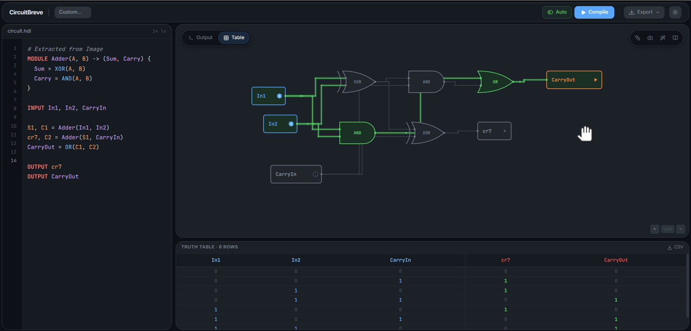
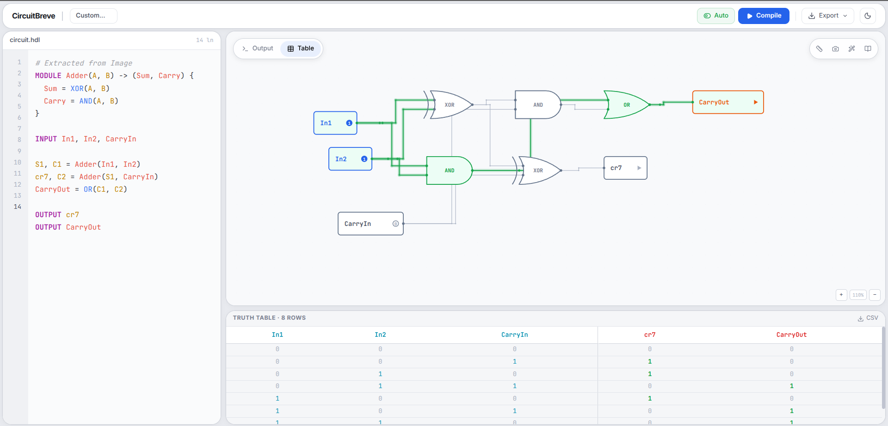

# CircuitBreve

A browser-based logic circuit simulator and visualizer. Write circuits in a custom HDL (Hardware Description Language), compile them in real time, and see the schematic rendered as an interactive SVG diagram.

Built with React, TypeScript, Vite, and Tailwind CSS. Runs entirely in the browser with no backend.





---

## Features

- Custom HDL with support for modules, gates, inputs, outputs, and nested expressions
- Real-time compilation with auto-compile (400ms debounce)
- Interactive SVG circuit rendering with pan, zoom, drag, and node toggling
- Live simulation: click inputs to toggle values and watch signals propagate
- Truth table generation (up to 10 inputs, 1024 rows)
- Boolean expression extraction from circuit outputs
- Syntax highlighting in the editor (keywords, gates, comments, variables)
- Resizable panels (editor, canvas, bottom panel, right panel)
- Dark and light themes with iOS-inspired rounded panel design
- Export to SVG, PNG (3x resolution), and PDF
- Boolean expression to HDL converter
- Image-to-HDL scanner (schematic recognition prototype)
- Configurable layout dimensions (node sizes, spacing, per-node overrides)

---

## Getting Started

```bash
npm install
npm run dev
```

Open `http://localhost:5173` in your browser.

### Build for production

```bash
npm run build
```

Produces a single `dist/index.html` file (all assets inlined via vite-plugin-singlefile).

---

## HDL Syntax

```
# Comments start with #

INPUT A, B, Cin

MODULE HalfAdder(A, B) -> (Sum, Carry) {
  Sum = XOR(A, B)
  Carry = AND(A, B)
}

S1, C1 = HalfAdder(A, B)
Sum, C2 = HalfAdder(S1, Cin)
Cout = OR(C1, C2)

OUTPUT Sum
OUTPUT Cout
```

### Supported Gates

AND, OR, NOT, NAND, NOR, XOR, XNOR, BUF, DFF, TFF, JKFF

### Syntax Rules

- `INPUT` declares clickable input signals
- `OUTPUT` declares output signals (optionally with inline expression)
- Gate assignments: `X = AND(A, B)` or nested `X = OR(AND(A, B), C)`
- Modules: define with `MODULE Name(inputs) -> (outputs) { body }`, instantiate with `Out1, Out2 = Name(args)`
- Signal names are case-sensitive
- Every signal must be defined before use

---

## Tech Stack

- React 19
- TypeScript 5.9
- Vite 7
- Tailwind CSS 4
- Lucide React (icons)
- No external circuit/graph libraries — all algorithms are custom

---

## Project Structure

```
src/
  compiler/       Lexer, parser, graph builder
  simulator/      Simulation engine, boolean expression extractor
  layout/         Sugiyama-style layered graph layout engine
  components/     React UI components
  hooks/          useCircuit (orchestration), useResizable (panel resize)
  context/        Theme provider (dark/light)
  types/          TypeScript type definitions
  utils/          Export utilities, className helper
```

---

## License

MIT
